# HouseYield

HouseYield is an independent project I started to explore a problem with remote rental-property ownership: finances, the physical condition of the house, tenant operations, and maintenance work usually live in separate systems. An owner might see cash flow in one place, a leak alert in another, and tenant or maintenance conversations somewhere else.

I’m building HouseYield as one workspace for those parts of the property. The goal is to help an owner understand what the property is earning, what is happening inside the building, and what needs attention without giving automation control over decisions that should still belong to a person.

**Privacy:** property, tenant, financial, and service-provider information in this public repo is fictional or sanitized demo data. Public screenshots do not display a street address. Any real businesses named are not customers, partners, or users of HouseYield.

## Highlights

- **Property finance:** Connects an Azure SQL accounting ledger to bookkeeping, tax records, cash flow, and investment metrics.
- **IoT property display:** Places sensors within the rooms and floors they monitor and shows how an issue could affect nearby spaces.
- **Maintenance automation:** Carries a sensor alert or tenant report through triage, provider search, owner approval, scheduling, and service tracking.
- **Tenant operations:** Covers onboarding, Stripe rent collection, leases, e-signatures, documents, maintenance requests, and messaging.
- **Controlled AI:** Uses deterministic rules for accounting, tax logic, and calculations while applying AI to documents, alerts, search, and conversations.

## Connecting finance, sensors, and operations

HouseYield connects three views of the same property. The financial side tracks rent, expenses, maintenance costs, cash flow, NOI, cap rate, cash-on-cash return, DSCR, reserves, mortgage amortization, equity, and projected performance. Federal Reserve data and local rental comparisons add context beyond the property’s own history.

The physical side is an IoT property display model that places leak, temperature, humidity, shutoff, and network-health devices in the rooms where they operate. I also combined flood, geographic, and USGS elevation data to experiment with showing how water might move through a neighborhood, across a lot, and into the building.

The operations side covers tenant onboarding, Stripe rent collection, leases, e-signatures, document storage, maintenance requests, tax packets, and messaging between owners and tenants. The most developed workflow connects a sensor alert or tenant report to maintenance triage, provider search, owner approval, scheduling, and service tracking.

HouseYield is still a prototype, not a finished property-management product. I’m using it to test whether these connections can reduce repetitive coordination while giving an owner a clearer picture of both the building and the investment.

## Product gallery

<table>
  <tr>
    <td>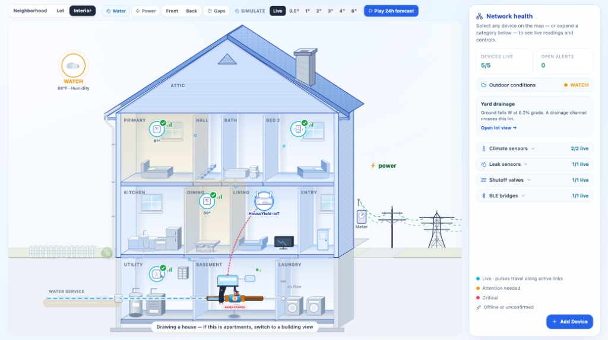</td>
    <td>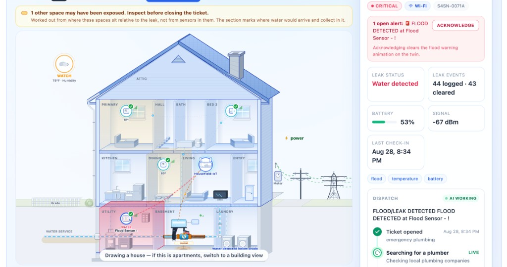</td>
  </tr>
  <tr>
    <td>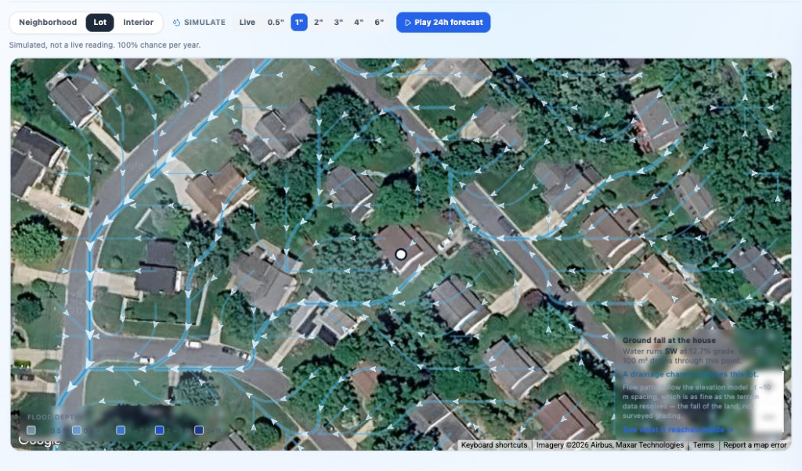</td>
    <td>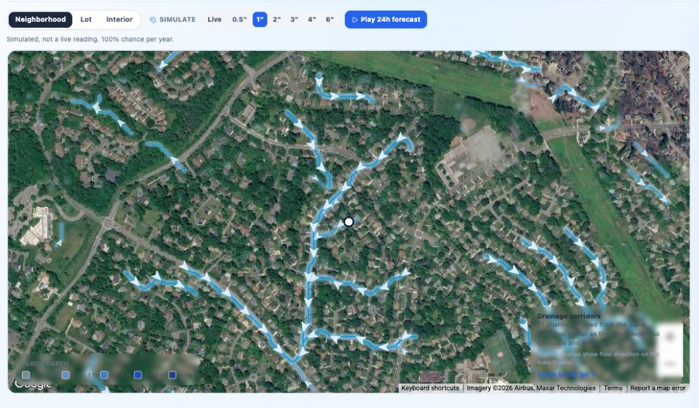</td>
  </tr>
  <tr>
    <td>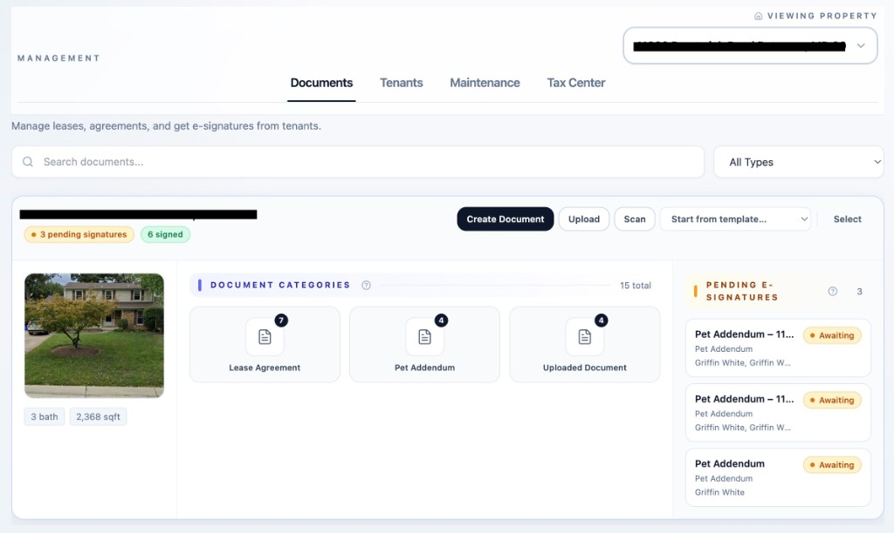</td>
    <td>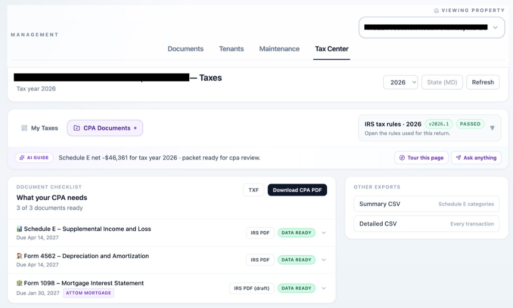</td>
  </tr>
  <tr>
    <td>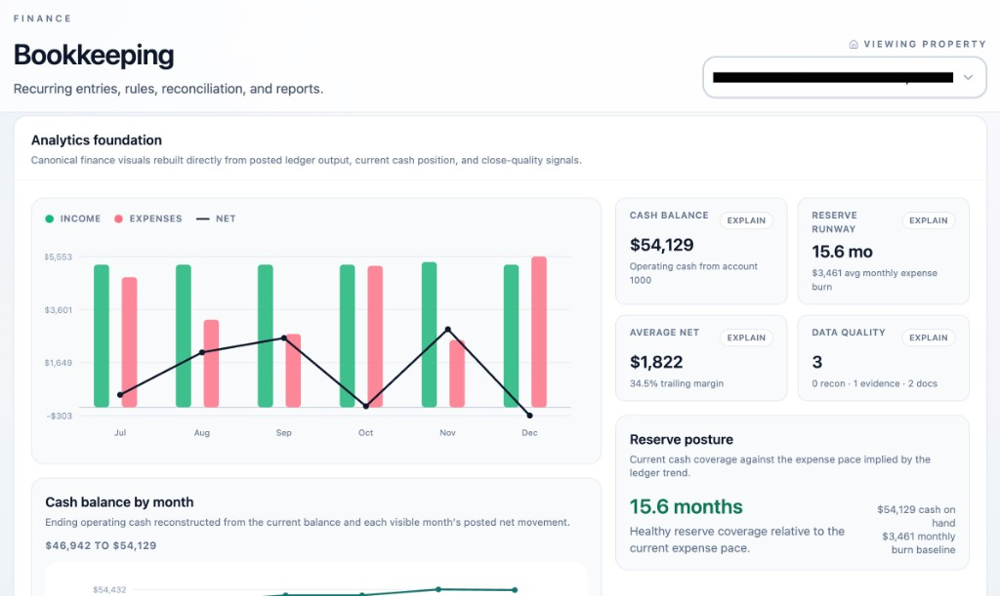</td>
    <td>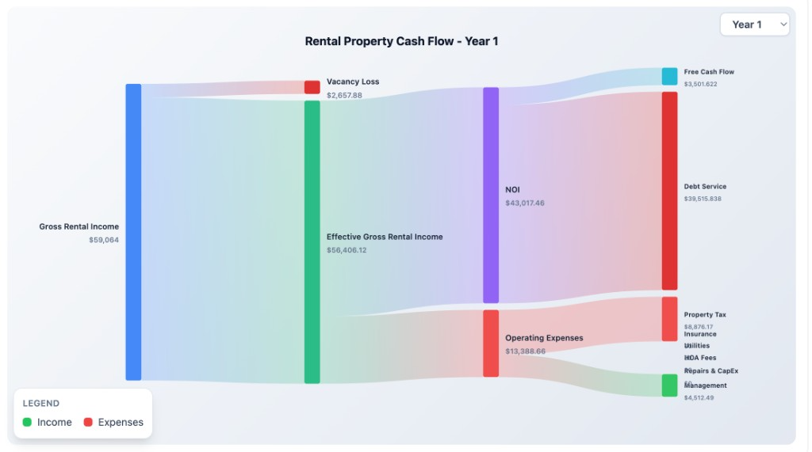</td>
  </tr>
  <tr>
    <td>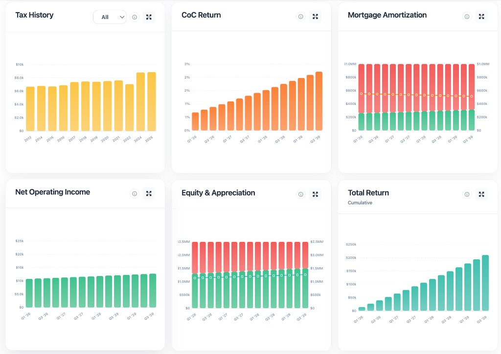</td>
    <td>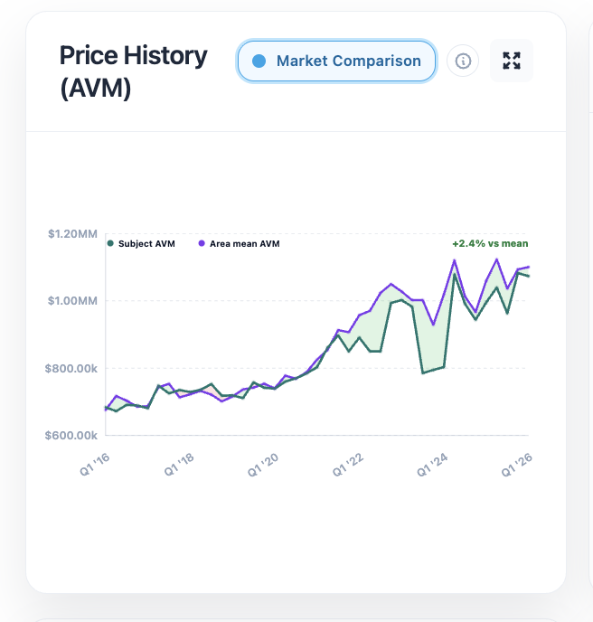</td>
  </tr>
  <tr>
    <td>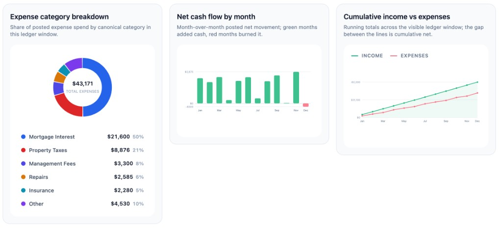</td>
    <td>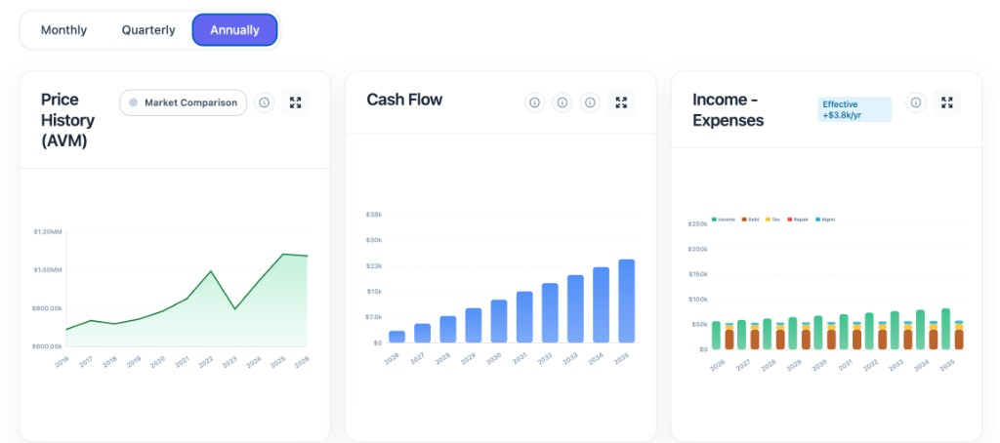</td>
  </tr>
</table>

## Visualizing sensor data

This is not a full engineering-grade digital twin. It is an IoT property display model designed to make sensor data easier to understand. Most sensor dashboards show a list of devices; HouseYield places each device in its room and floor within a cutaway of the property, so an owner can see what it protects, what is nearby, and where an alert is happening.

That layout also captures how rooms and floors relate to one another. HouseYield can use those relationships to model where water may spread, flag nearby spaces that could be exposed even without their own sensor, and attach the room, device, and surrounding conditions to a maintenance ticket. The display becomes a shared visual layer for monitoring the building and responding when something goes wrong.

## Maintenance automation

A leak sensor or tenant report can open a maintenance ticket with the property, room, device state, and recent conditions already attached. HouseYield can summarize the issue, search for a relevant provider, prepare an owner update, and wait for approval before dispatch.

After approval, the workflow can use Twilio and OpenAI voice to call a provider, ask about availability, and return the scheduling outcome to the ticket. Service status and supporting documents stay with the maintenance record. An invoice becomes accounting activity only when the related payment is approved and posted; a sensor alert does not automatically become a financial transaction.

## Rule-based logic and AI

I separate work that needs predictable rules from work that benefits from flexible interpretation. Accounting entries, financial calculations, validation checks, and versioned tax logic run through deterministic code. AI is used for less structured work such as classifying documents, summarizing alerts, interpreting a request, searching across variable sources, drafting updates, and handling part of a provider conversation.

The financial assistant follows the same boundary. It retrieves information only for the signed-in owner and calls defined calculation tools rather than inventing a metric from a prompt. AI output is checked against system rules or presented for owner review before it can affect an important record or action.

The point is not to automate every decision. It is to use AI where the inputs are messy or conversational, then bring the result back inside a workflow with known data, deterministic checks, and a person in control.

## How I structured the data

I split the system by the kind of record it owns. Firebase Authentication handles identity, Cloud Firestore stores operational data such as properties, tenants, maintenance work, device state, and document metadata, and Firebase Storage holds files such as photos, receipts, and leases.

Azure SQL owns the financial records. Shared owner and property identifiers connect activity across the systems, so a leak alert can be linked to its maintenance ticket and the eventual repair cost while the sensor reading, service record, and accounting entry each keep their own source record.

## Financial controls and metrics

Payments and expenses become source events, finance events, balanced journal entries, and debit or credit lines linked to the relevant accounts, properties, vendors, tenants, and supporting documents. Foreign keys preserve those relationships, while source-event and idempotency keys prevent a Stripe payment or imported transaction from posting twice.

I also keep actual results separate from projections. Posted ledger activity feeds bookkeeping summaries and tax exports, while portfolio charts model future performance from assumptions such as rent, vacancy, costs, debt, and property value. NOI, cash flow, cap rate, and DSCR use explicit formulas, and a missing input leaves a metric unavailable instead of quietly treating the value as zero.

## My role

I designed and built the product as an independent project, including the owner and tenant experiences, financial model, accounting rules, IoT property display, sensor integrations, and maintenance workflows. Most of the design work has been deciding which system should own each record, how outside data should be validated, where deterministic logic is necessary, and where automation can safely reduce manual work.

I use AI coding tools to help implement and test the product, then revise the design when accounting fixtures, unit tests, and visual property-model baselines expose gaps. The project has been less about generating features and more about turning property-management decisions into data and workflows that remain understandable when something goes wrong.

**Stack:** React, TypeScript, Express, Azure SQL, Cloud Firestore, Firebase Storage, Stripe, OpenAI, Twilio, Federal Reserve and rental-market data, geographic and flood layers, and Shelly sensors.
